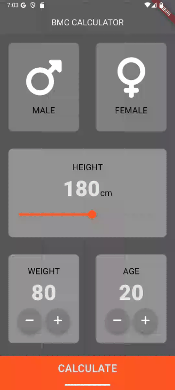

# 🧮 BMI Calculator App

This is a simple and elegant **BMI (Body Mass Index)** Calculator built using **Flutter**.  
It allows users to input their gender, height, weight, and age, then calculates their BMI and provides a result with an interpretation.

---

## 📱 demonstration




## 📱 Features

- Gender selection (male/female)
- Height selection with a custom slider
- Weight and age adjustment using rounded buttons
- BMI calculation with result interpretation
- Clean, responsive UI using custom widgets

---

## 🎯 What I Learned

This project helped me understand and practice several core concepts of Flutter development:

- ✅ **Widgets composition**: I created and reused custom widgets like `StandardCard`, `ContentIcon`, `RoundedButton`, and `Lowbutton` to build a clean interface.
- ✅ **State management**: I used `setState()` to dynamically update values like weight, age, and height in real time.
- ✅ **Navigation**: I implemented navigation between screens using `Navigator.push` and `Navigator.pop`.
- ✅ **UI Design**: I worked with `ThemeData`, `AppBarTheme`, `Slider`, `GestureDetector`, and layout widgets like `Column`, `Row`, and `Expanded`.
- ✅ **Constants management**: I organized style constants in a separate `consts.dart` file to keep the code clean and consistent.
- ✅ **Basic Dart OOP**: I created a `CalcIMC` class to handle BMI logic, including interpretation and formatted results.

---

## 📂 Folder Structure

```
lib/
├── components/
│   ├── content_icon.dart
│   ├── low_button.dart
│   ├── rounded_button.dart
│   └── standard_card.dart
├── screens/
│   ├── mainscreen.dart
│   └── result_screen.dart
├── calc_imc.dart
├── consts.dart
└── main.dart
```

---

## 🛠️ Technologies Used

- **Flutter** (Dart)
- **font_awesome_flutter** for icons
- **Material Design** components

---

## 🚀 Getting Started

To run the project locally:

```bash
git clone https://github.com/your-username/your-repo-name.git
cd your-repo-name
flutter pub get
flutter run
